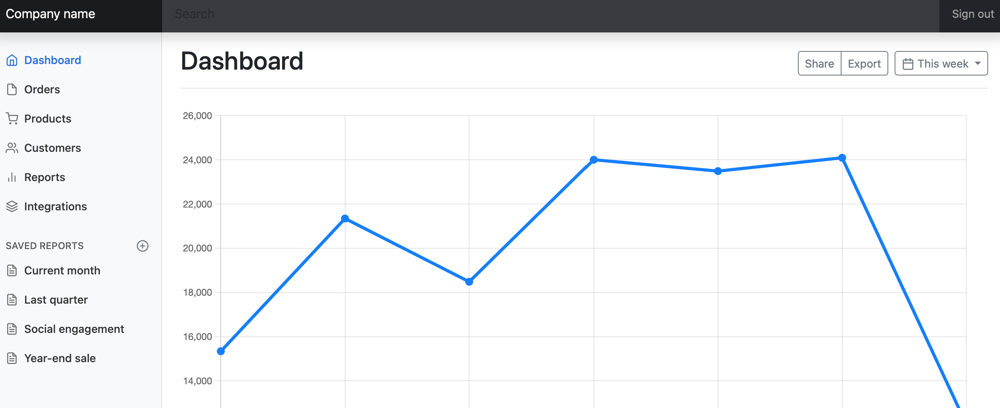

# Nginx Docker Bootstrap Dashboard Demo

Bootstrap tabanlı statik web sayfalarınızı Nginx web sunucusu ile nasıl yayınlanacağını gösteren bir örnek. 
* Bootstrap içeren statik web sitesi src klasöründedir.
* Dockerfile dosyasında src klasörünü nginx sunucusuna kopyalayan kod parçaları yer almaktadır.

## Çalıştırma

* docker build -t nginx . 
* docker run -d --name web -p 8080:80 nginx

